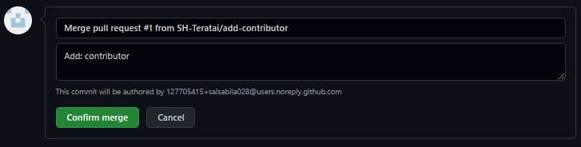

 # Git untuk Kolaborasi
  
 Dalam pembahasan ini:
  
  1. Upstream author adalah oldstager.
  2. Kontributor adalah SH-Teratai
  3. Repo dari upstream author adalah playground yang bisa diakses di https://github.com/salsabila028/playground
  
  ## Fork
  
  Fork adalah membuat clone dari suatu repo di GitHub milik upstream author, diletakkan ke milik kontributor. Fork hanya dilakukan sekali saja. Pada dasarnya, proses untuk fork ini meliputi:
  
  1. Fork repo di web GitHub.
  2. Clone fork tersebut di komputer lokal.
  
  Kontributor harus mem-fork repo upstream author sehingga di repo kontributor muncul repo tersebut. Proses forking ini dijelaskan dengan langkah-langkah berikut:
  
  1. Login ke GitHub
  2. Akses repo yang akan di-fork: https://github.com/salsabila028/playground
  3. Pada sisi kanan atas, klik Fork:
  
   
  
  4. Pilih akan ditempatkan di account mana.
  5. Setelah proses, repo dari upstream author sudah berada di account GitHub kita (kontributor)
  
  
  
  Setelah proses tersebut, clone di komputer lokal:
  
  
  
  Setelah itu, konfigurasikan repo lokal kontributor. Pada kondisi saat ini, di komputer lokal sudah terdapat repo playground-1 yang berada pada direktori dengan nama yang sama. Untuk keperluan berkontribusi, ada 2 nama repo yang harus diatur:

    1. origin: menunjuk ke repo milik kontributor di GitHub, hasil dari fork.
    2. upstream: menunjuk ke repo milik upstream author (repo asli) di account oldstager.
  
Repo origin sudah dituliskan konfigurasinya pada saat melakukan proses clone dari repo kontributor. Konfigurasi repo upstream harus dibuat.
  
  
  
  Tambahkan remote upstream:
  
   
  
  Hasil :
  
   
  
  ## Mengirimkan Pull Request
  
Setiap kali melakukan perubahan, kirim perubahan tersebut. Pengiriman ini disebut dengan Pull Request. Pada posisi ini, kontributor bisa mengirimkan kontribusi dengan cara mengirimkan pull request (PR) ke upstream author. Secara umum, langkah-langkahnya adalah sebagai berikut:

   1. Kontributor akan bekerja di repo lokal (create, update, delete isi)
   2. Commit
   3. Push ke repo kontributor
   4. Kirimkan PR ke repo upstream author.
   5. Upstream author me-review dan kemudian menyetujui (merge) ke master atau menolak PR.
   6. Jika disetujui dan di-merge ke repo master dari upstream author, sinkronkan repo di komputer       lokal dan repo GitHub kontributor.
  
Berikut ini adalah contoh pengiriman perubahan isi README.md dengan menambahkan kontributor.
  
  ## Membuat Perubahan di Repo Lokal
  
  Sebelum melakukan perubahan, pastikan:

   1. Sudah ada koordinasi secara manual tentang perubahan-perubahan yang akan dilakukan.
   2. Setelah melakukan perubahan-perubahan, pastikan bahwa isi repo lokal tersinkronisasi dengan       repo dari upstream author.
   3. Cara melakukan sinkronisasi:
  
   
  
   4. Lakukan perubahan-perubahan, setelah itu push ke origin (milik kontributor)
  
  
  
   5. Setelah itu, buka halaman Web dari repo kontributor https://github.com/SH-Teratai/playground-1. Pada halaman tersebut akan ditampilkan isi yang kita push.
  
  
  
   6. Pilih Compare and pull request, kemudian isikan deskripsi PR dan klik pada Create pull request:
  
  
  
   7. Pada repo upstream author, muncul angka 1 (artinya jumlahnya 1) pada Pull requests di bagian atas.
  
  
  
   8. Upstream author bisa menyetujui setelah melakukan review: klik pada Pull requests, akan muncul PR dengan message seperti yang ditulis oleh kontributor (Add: contributor). Klik pada PR tersebut, review kemudian klik Merge pull request diikuti dengan Confirm merge. Setelah itu, status akan berubah menjadi Merged.
  
  
  
   9. Sinkronkan semua repo (lokal maupun GitHub kontributor)
  
  
  
  ## Konflik
  
  Ada kemungkinan, jika satu orang mengirimkan PR untuk satu atau lebih file dan sementara itu ada lainnya juga yang mengirimkan PR pada satu atau lebih file yang sama, maka akan terjadi konflik karena ada satu atau lebih file yang sama yang di-edit dan akan di-merge. Jika sampai terjadi kasus seperti ini, maka upatream author harus menolak semua PR dan kemudian masing-masing kontributor diharapkan menyelesaikan secara manual (offline) kemudian memutuskan siapa yang akan mengirimkan PR.
