# Instalasi Git For Window

   Sebelum install Git di Windows, anda harus sudah mempunyai editor teks yang didukung oleh Windws. Editor yang bisa dipilih banyak, tetapi disarankan menggunakan Notepad++ atau Visual Studion Code atau Vim. Keberadaan editor teks ini akan menentukan keberhasilan instalasi.

1. Setelah download Git, double click pada file yang di-download. Akan dimunculkan lisensi. Klik Next untuk lanjut. 

2. Setelah itu, pilih lokasi instalasi. Secara default akan terisi C:\Program Files\Git. Ganti lokasi jika memang anda menginginkan lokasi lain, klik Next

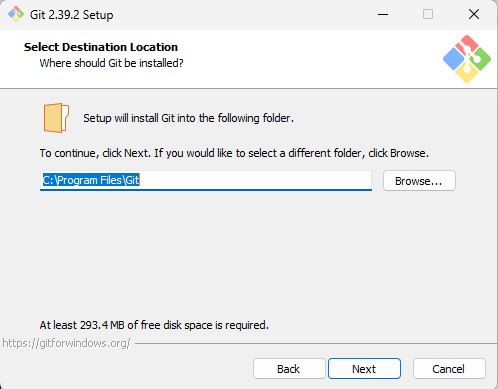

3. Pilih komponen. Tidak perlu diubah-ubah, sesuai dengan default saja. Klik pada Next.

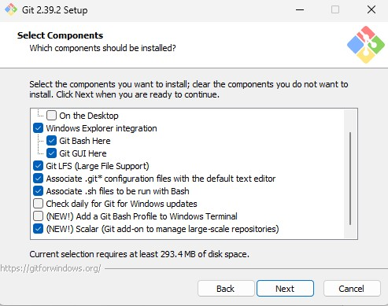

4. Mengisi shortcut untuk menu Start. Gunakan default (Git), ganti jika ingin mengganti - misalnya Git VCS.

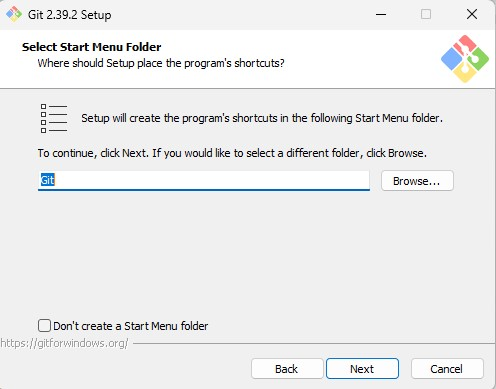

5. Pilih editor yang akan digunakan bersama dengan Git. Pada pilihan ini, digunakan Vim editor.

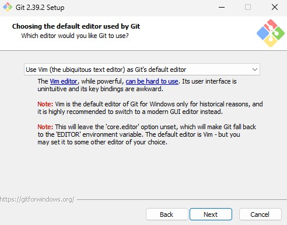

6. Pada saat instalasi, Git menyediakan akses git melalui Bash maupun command prompt. Pilih pilihan kedua supaya bisa menggunakan dari dua antarmuka tersebut. Bash adalah shell di Linux. Dengan menggunakan bash di Windows, pekerjaan di command line Windows bisa dilakukan menggunakan bash - termasuk ekskusi dari Git.

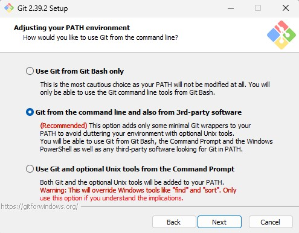

7. Pilih OpenSSL untuk HTTPS. Git menggunakan https untuk akes ke repo GitHub atau repo-repo lain (GitLab, Assembla).

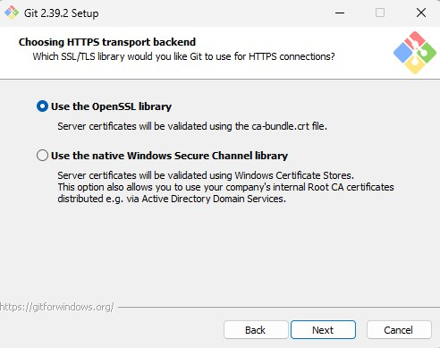

8. Pilih pilihan pertama untuk konversi akhir baris (CR-LF).

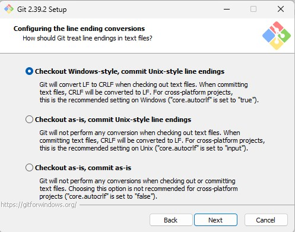

9. Pilih PuTTY untuk terminal yang digunakan untuk mengakses Git Bash.

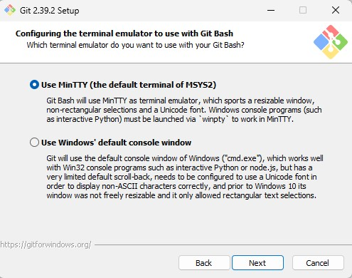

10. Untuk opsi ekstra, pilih serta aktifkan 1 dan 2.

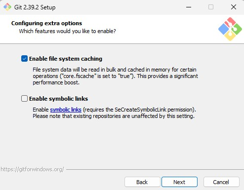

11. Setelah itu proses instalasi akan dilakukan.

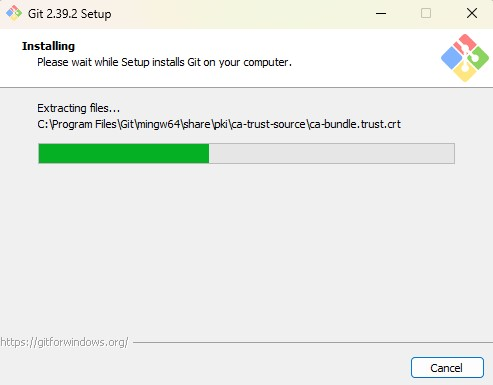

12. Jika selesai akan muncul dialog pemberitahuan. Klik pada Finish.

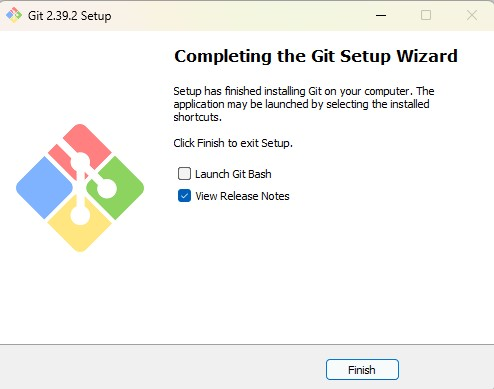

13. Untuk menjalankan, dari Start menu, ketikkan "Git", akan muncul beberapa pilihan. Pilih "Git Bash" atau "Git GUI".

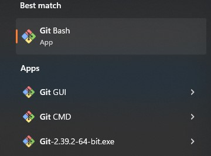

14. Tampilan jika akan menggunakan "Git Bash"

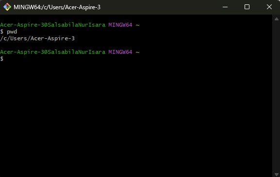

15. Tampilan jika akan menggunakan "Git GUI"

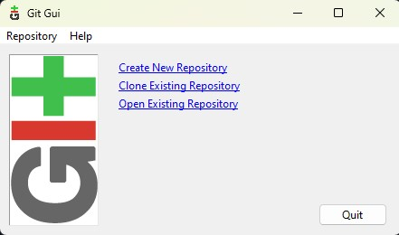

16. Untuk mencoba dari command prompt, masuk ke command prompt, setelah itu eksekusi "git --version" untuk melihat apakah sudah terinstall atau belum. Jika sudah terinstall dengan benar, makan akan muncul hasil berikut:

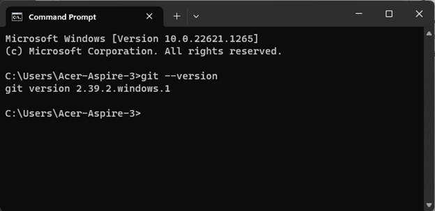

## Konfigurasi Git

Ada 2 hal yang perlu dikonfigurasi yaitu username dan email. Untuk itu gunakan perintah berikut :

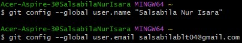

Isian di atas harus disesuaikan dengan nama serta email yang digunakan untuk mendaftar di GitHub. Untuk melihat konfigurasi yang sudah ada:

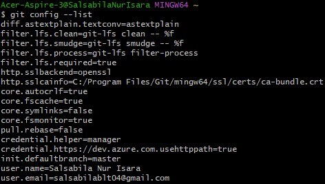

Langkah ini cukup dilakukan sekali saja, kecuali jika ingin melakukan perubahan nama dan email.

# Mengelola Repo Sendiri di Account Sendiri

Setiap orang yang telah mempunyai account di GitHub bisa membuat repo dengan. Secara umum, langkah-langkahnya adalah sebagai berikut:
1. Buat repo kosong di GitHub, bisa public maupun private.
2. Cloe repo kosong tersebut di komputer lokal
3. Perintah berikutnya terkait dengan perubahan repo serta sinkronisasi antara GitHub dengan lokal.

## Membuat Repo

Untuk membuat repo, gunakan langkah-langkan berikut:
1. Klik tanda + pada bagian atas setelah login, pilih New repository

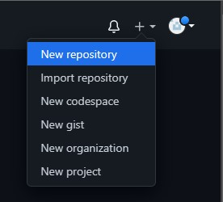

2. Isikan nama, keterangan, serta lisensi. Jika dikehendaki, bisa membuat repo Private

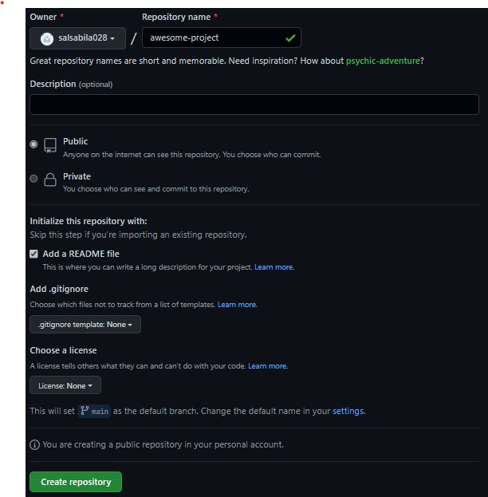

3. Klik Create Repository

Setelah langkah-langkah tersebut, repo akan dibuat dan bisa diakses menggunakan pola https://github.com/username/reponame. Pada repo tersebut, hanya akan muncul 1 file, yaitu LICENSE. Jika memilih membuat README pada saat langkah ke 2, juga akan muncul README.md. Ada atau tidak ada README.md tidak mempunyai efek apapun pada langkah ini.

## Clone Repo

Proses clone adalah proses untuk menduplikasikan remote repo di GitHub ke komputer lokal. Untuk melakukan proses clone, gunakan perintah berikut:

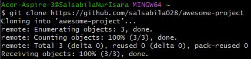

Setelah perintah ini, di direktori awesome-project akan disimpan isi repo yang sama dengan di GitHub. Perbedaannya, di komputer lokal terdapat direktori .git yang digunakan secara internal oleh Git.

## Mengelola Repo

Beberapa hal yang bisa dilakukan akan diuraikan sebagai berikut.

### Mengubah Isi - Push Tanpa Branching dan Merging

Perubahan isi bisa terjadi karena satu atau kombinasi beberapa hal berikut:
1. File dihapus
2. File diedit
3. Membuat file / direktori baru
4. Menghapus direktori

Untuk kasus-kasus tersebut, lakukan perubahan di komputer lokal, setelah itu push ke repo.

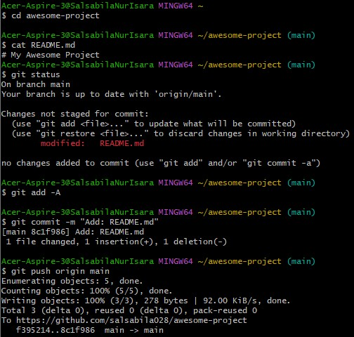

Cara ini lebih mudah tetapi mempunyai resiko jika terjadi kesalahan dalam edit. Cara yang lebih aman tetapi memerlukan langkah yang lebih panjang adalah branching and merging.

## Mengubah Isi dengan Branching and Merging

Cara ini lebih aman, terstruktur, terkendali, dan mempunyai history yang lebih baik. Jika perubahan yang kita buat sudah terlalu kacau dan kita menyesal, maka ada cara untuk "membersihkan" repo lokal kita. Secara umum, langkahnya adalah sebagai berikut:

1. Buat branch untuk menampung perubahan-perubahan
2. Lakukan perubahan-perubahan
3. Add dan commit perubahan-perubahan tersebut ke branch
4. Kembali ke repo master
5. Buat pull request di GitHub
6. Merge pull request di GitHub
7. Merge branch untuk menampung perubahan-perubahan tersebut ke master.
8. Selesai.

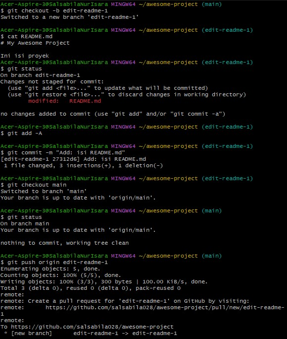

Setelah itu, kirim pull request (PR):

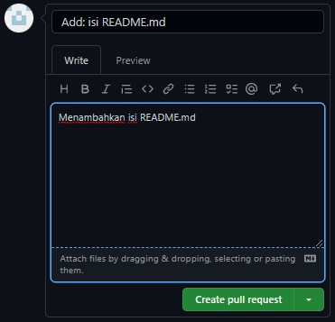

Setelah membuat PR, PR tersebut bisa di-merge:

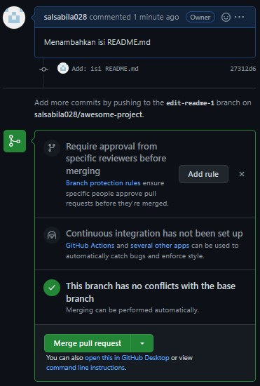

Setelah itu, Confirm Merge, branch yang kita kirimkan tadi sudah dimasukkan ke branch master. Setelah itu, merge di komputer lokal:

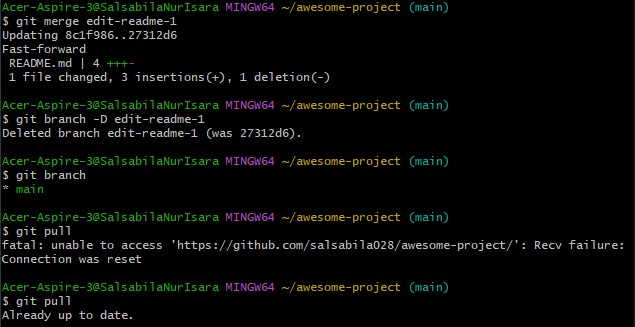

## Sinkronisasi

Suatu saat, bisa saja terjadi kita menggunakan komputer lain dan mengedit repo melalui repo lokal di komputer lain, setelah itu pindah ke kamputer lain lagi. Saat itu, kita perlu melakukan sinkronisasi ke kemputer lokal. Perintah untuk sinkronisasi adalah:

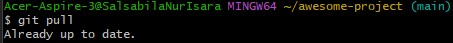

Perintah ini dikerjakan di direktori tempat repo lokal kita berada.

## Membatalkan Perubahan

 Jika perubahan-perubahan yang kita lakukan sudah sedemikian kacaunya, maka kita bisa membuat supaya perubahan-perubahan yang kacau tersebut hilang dan kembali ke kondisi bersih seperti semula.
 
 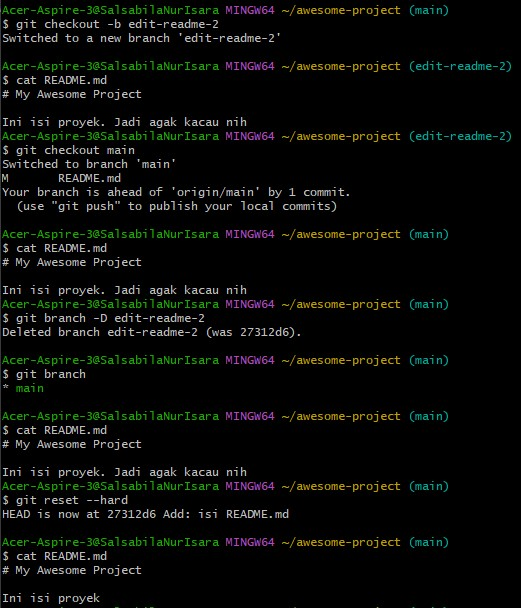
 
 ## Undo Commit Terakhir
 
 Suatu saat, mungkin kita sudah terlanjur mem-push perubahan ke repo GitHub, setelah itu kita baru menyadari bahwa perubahan tersebut salah. Untuk itu, kita bisa melakukan git revert.
 
 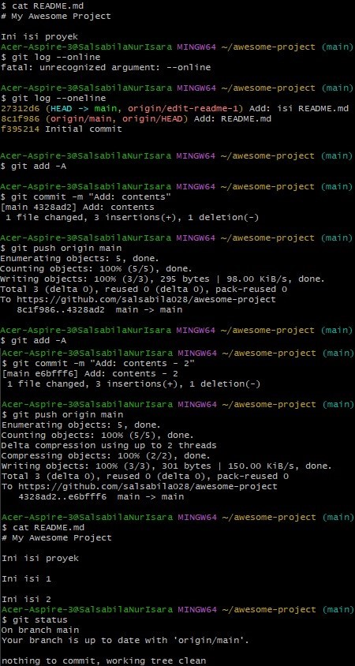
  
  Contoh di atas adalah contoh untuk mengubah README.md dengan beberapa commit. Setelh itu, kita akan mengembalikan ke posisi terakhir sebelum commit terakhir.
  
 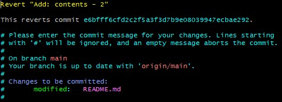
 
 Perintah di atas akan membuka editor. Pada editor tersebut kita bisa mengetikkan pesan revert ( = pesan commit untuk pembatalan). Setelah selesai, simpan.
 Selanjutnya, tinggal di-push ke repo GitHub.
 
 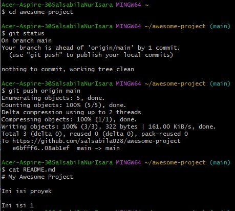
 
 Jika commit sudah dilakukan, tetapi belum di-push ke repo GitHub (masih berada di lokal), cara membatalkannya:
 
 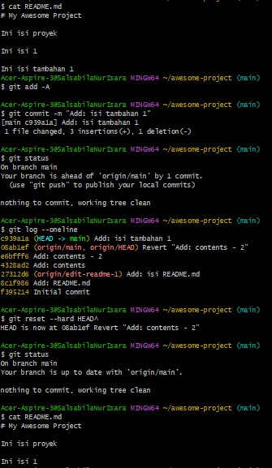
 
 Untuk kembali ke perubahan pada saat yang sudah lama, yang perlu dilakukan adalah melakukan git revert <posisi> kemudian mengedit secara manual kemudian push ke repo.
  
 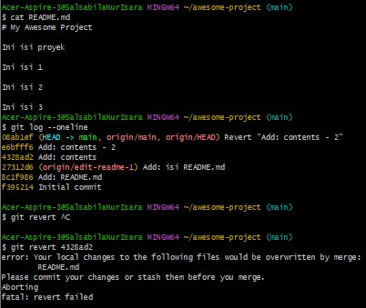
  
  Setelah itu, jika dilihat pada file, akan muncul tambahan untuk memudahkan meng-edit. File ini harus di-resolve terlebih dahulu, setelah itu baru di add dan commit, Edit file tersebut, setelah itu simpan.
  
  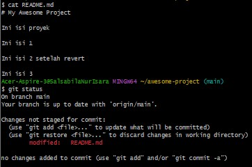
  
  Setelah itu, lanjutkan proses revert. Saat git revert --continue isikan pesan revert.
  
   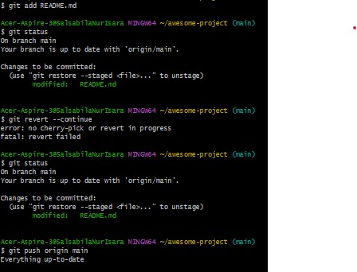
  
  
  # Mengelola Repo Sndiri di Organisasi
  
  Repo yang dibuat bisa diletakkan pada account kita maupun berada pada suatu organisasi. Organisasi bisa kita buat sendiri maupun kita dimasukkan menjadi anggota organisasi. Pada dasarnya, bagian ini sama dengan bagian sebelumnya, hanya saja, pada saat membuat repo Owner dari repo adalah organisasi seperti berikut ini:

 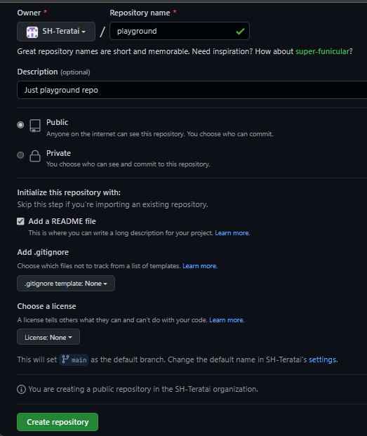
  
  ### Clone Repo
  
  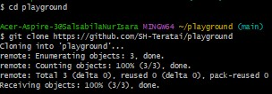
  
  Untuk operasi-operasi lainnya sama saja dengan pembahasan sebelumnya.
  
  # Git untuk Kolaborasi
  
 Dalam pembahasan ini:
  
  1. Upstream author adalah oldstager.
  2. Kontributor adalah SH-Teratai
  3. Repo dari upstream author adalah playground yang bisa diakses di https://github.com/salsabila028/playground
  
  ## Fork
  
  Fork adalah membuat clone dari suatu repo di GitHub milik upstream author, diletakkan ke milik kontributor. Fork hanya dilakukan sekali saja. Pada dasarnya, proses untuk fork ini meliputi:
  
  1. Fork repo di web GitHub.
  2. Clone fork tersebut di komputer lokal.
  
  Kontributor harus mem-fork repo upstream author sehingga di repo kontributor muncul repo tersebut. Proses forking ini dijelaskan dengan langkah-langkah berikut:
  
  1. Login ke GitHub
  2. Akses repo yang akan di-fork: https://github.com/salsabila028/playground
  3. Pada sisi kanan atas, klik Fork:
  
   
  
  4. Pilih akan ditempatkan di account mana.
  5. Setelah proses, repo dari upstream author sudah berada di account GitHub kita (kontributor)
  
  
  
  Setelah proses tersebut, clone di komputer lokal:
  
  
  
  Setelah itu, konfigurasikan repo lokal kontributor. Pada kondisi saat ini, di komputer lokal sudah terdapat repo playground-1 yang berada pada direktori dengan nama yang sama. Untuk keperluan berkontribusi, ada 2 nama repo yang harus diatur:

    1. origin: menunjuk ke repo milik kontributor di GitHub, hasil dari fork.
    2. upstream: menunjuk ke repo milik upstream author (repo asli) di account oldstager.
  
Repo origin sudah dituliskan konfigurasinya pada saat melakukan proses clone dari repo kontributor. Konfigurasi repo upstream harus dibuat.
  
  
  
  Tambahkan remote upstream:
  
   
  
  Hasil :
  
   
  
  ## Mengirimkan Pull Request
  
Setiap kali melakukan perubahan, kirim perubahan tersebut. Pengiriman ini disebut dengan Pull Request. Pada posisi ini, kontributor bisa mengirimkan kontribusi dengan cara mengirimkan pull request (PR) ke upstream author. Secara umum, langkah-langkahnya adalah sebagai berikut:

   1. Kontributor akan bekerja di repo lokal (create, update, delete isi)
   2. Commit
   3. Push ke repo kontributor
   4. Kirimkan PR ke repo upstream author.
   5. Upstream author me-review dan kemudian menyetujui (merge) ke master atau menolak PR.
   6. Jika disetujui dan di-merge ke repo master dari upstream author, sinkronkan repo di komputer       lokal dan repo GitHub kontributor.
  
Berikut ini adalah contoh pengiriman perubahan isi README.md dengan menambahkan kontributor.
  
  ## Membuat Perubahan di Repo Lokal
  
  Sebelum melakukan perubahan, pastikan:

   1. Sudah ada koordinasi secara manual tentang perubahan-perubahan yang akan dilakukan.
   2. Setelah melakukan perubahan-perubahan, pastikan bahwa isi repo lokal tersinkronisasi dengan       repo dari upstream author.
   3. Cara melakukan sinkronisasi:
  
   
  
   4. Lakukan perubahan-perubahan, setelah itu push ke origin (milik kontributor)
  
  
  
   5. Setelah itu, buka halaman Web dari repo kontributor https://github.com/SH-Teratai/playground-1. Pada halaman tersebut akan ditampilkan isi yang kita push.
  
  
  
   6. Pilih Compare and pull request, kemudian isikan deskripsi PR dan klik pada Create pull request:
  
  
  
   7. Pada repo upstream author, muncul angka 1 (artinya jumlahnya 1) pada Pull requests di bagian atas.
  
  
  
   8. Upstream author bisa menyetujui setelah melakukan review: klik pada Pull requests, akan muncul PR dengan message seperti yang ditulis oleh kontributor (Add: contributor). Klik pada PR tersebut, review kemudian klik Merge pull request diikuti dengan Confirm merge. Setelah itu, status akan berubah menjadi Merged.
  
  
  
   9. Sinkronkan semua repo (lokal maupun GitHub kontributor)
  
  
  
  ## Konflik
  
  Ada kemungkinan, jika satu orang mengirimkan PR untuk satu atau lebih file dan sementara itu ada lainnya juga yang mengirimkan PR pada satu atau lebih file yang sama, maka akan terjadi konflik karena ada satu atau lebih file yang sama yang di-edit dan akan di-merge. Jika sampai terjadi kasus seperti ini, maka upatream author harus menolak semua PR dan kemudian masing-masing kontributor diharapkan menyelesaikan secara manual (offline) kemudian memutuskan siapa yang akan mengirimkan PR.
