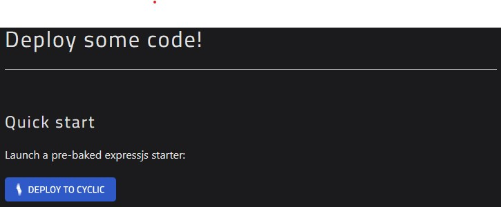

### Untuk menggabungkan antara GIT dan Cyclic bisa menggunakan langkah sebagai berikut :
klik link berikut  lalu scrol ke bawah sampe menemukan bagian seperti pada gambar dibawah dan klik di bagian Deploy To Cyclic

