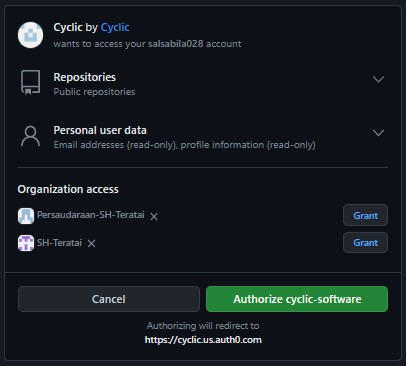
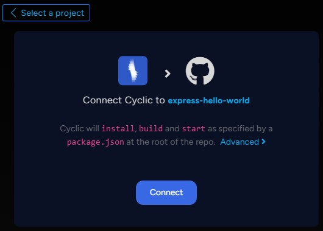
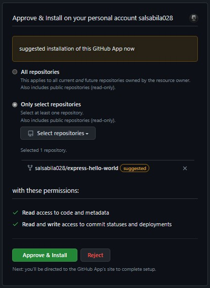
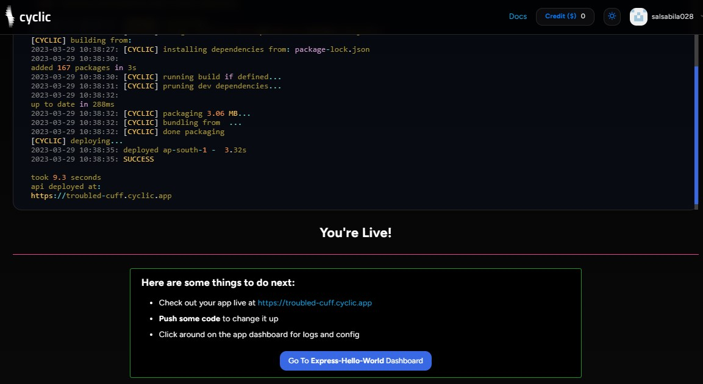
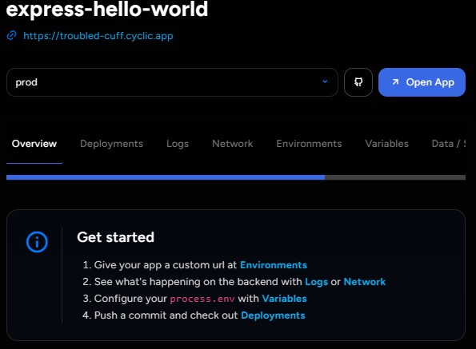

### Untuk menggabungkan antara GIT dan Cyclic bisa menggunakan langkah sebagai berikut :
klik link berikut [Dokumentasi Cyclic](https://docs.cyclic.sh/) lalu scrol ke bawah sampe menemukan bagian seperti pada gambar dibawah dan klik di bagian Deploy To Cyclic

setelah muncul tampilan seperti pada gambar dibawah klik Continue with GitHub

maka akan muncul tampilan seperti pada gambar dibawah setelah itu klik Authorize cyclic-software

setelah itu dari cyclic akan otomatis membuatkan repository untuk git anda lalu klik Connect

selah itu kembali ke git anda dan untuk menghubungkan klik Approve & Install

finally Git anda sudah terhubung degan cyclic 

Untuk memastikannya anda bisa masuk ke repository dari cyclic, anda bisa klik bagian Go To Express-Hello-World Dashboard pada gambar di atas, lalu akan muncul tampilan seperti pada gambar dibawah 

jika sudah seperti itu maka langkahnya sudah selesai.
