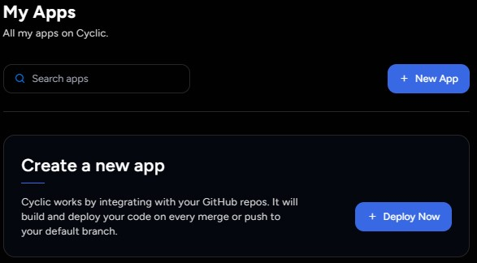

## Berikut Langkah Untuk Login ke Cyclic melalui Git

Silahkan anda klik [Dokumentasi Cyclic](https://docs.cyclic.sh/) scrol sampai bawah sampai menemukan bagian seperti pada gambar di bawah

setelah itu klik link [Sign up](https://cyclic.us.auth0.com/u/login?state=hKFo2SBTQ0NoUFpGalZ6aHlVV2hjNTd3MjBwNTFlMDFUNm8xMKFur3VuaXZlcnNhbC1sb2dpbqN0aWTZIEc2U1ZrMlhEdVJxZ1hGT2xzWUdyVm1id3c3cnh1RkxJo2NpZNkgb1JqTndtN3pqVHB3MjcwWXJQdk5RSHdpZm53RnlDTXo) seperti yang telah tertera pada gambar di atas setelah itu akan muncul tampilan seperti pada gambar di bawah

konekkan cyclic dengan git anda terlebih dahulu, setelah itu akan muncul tampilan seperti gambar di bawah 

setelah itu klik + Deploy Now di bagian Create a new app seperti yang telah tertera pada gambar di atas, maka akan muncul tampilan seperti pada gambar di bawah 

dibagian ini anda disuruh untuk menghubungkan repository anda dengan cyclic, anda bisa membuat repository baru maupun menggunakan yang sudah ada, cari repository yang akan anda hubungkan setelah itu klik repositorynya

jika muncul tampilan untuk mentautkan berbayar maka pilih bagian free
setelah muncul tampilan seperti gambar diatas maka klik Connect untuk menghubungkan
lalu masuk ke git anda dan berikan access untuk repository yang anda hubungkan dengan cyclic, ketika muncul tampilan seperti pada gambar di bawah klik Approve and instal

Note : untuk repository yang anda hubungkan ke cyclic setidaknya sudah ada file di dalamnya, lalu tambahkan file json dan server dari java script ke dalam repository tersebut

jika sudah muncul tampilan seperti pada gambar di bawah maka langkah sukses dan anda sudah login Cyclic yang di drect ke GIT

